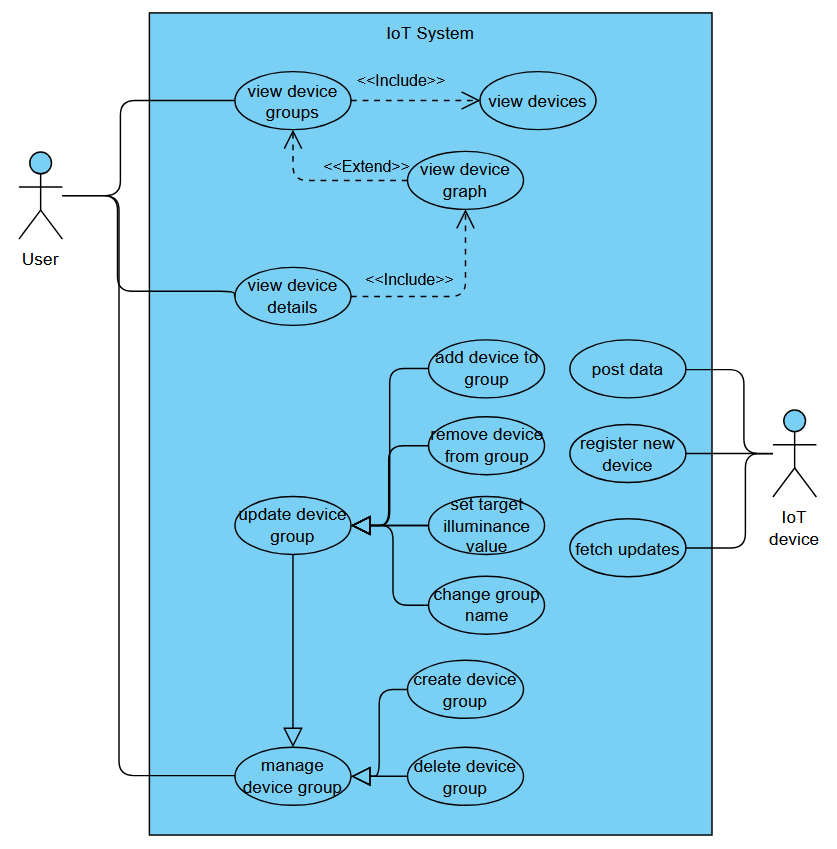

# Лабораторная №1

## Система автоматического управления освещенностью в помещении

Предположим, что есть офисное здание, в котором 10 этажей, на каждом из которых 10 помещений в среднем с 15 лампочками и одним датчиком освещенности в каждом. 
Задача системы: автоматически поддерживать задаваемый уровень освещенности.

Для упрощения реализации были сделаны допущения в предметной области:
 - лампочки в помещении расставлены таким образом, что свет в помещении распределяется равномерно и одного датчика в любом месте помещения достаточно, вследствие чего группа лампочек может быть связана только с одним датчиком

Есть два типа IoT устройств:
 - Диммируемые лампы (настраиваемая яркость)
 - Датчик света, определяющий уровень освещенности

Эти устройства взаимодействует с системой посредством REST API:
 - Лампочка опрашивает сервер о наличии обновлений своего состояния (яркости)
 - Датчик света отправляет свой показатель освещенности

Система управляет уровнем яркости лампочек для того, чтобы поддерживать целевое значение уровня освещенности.

Предлагаемое решение получает от датчиков значения освещенности и в случае отклонения изменяет значения яркости лампочек в привязанной к датчику группе на ΔL. В наиболее примитивном варианте все лампочки в группе будут иметь одинаковую яркость. В качестве усложнения система может пытаться оптимизировать количество потребляемой энергии за счет различной энергоэффективности лампочек (включая неэнергоэффективные лампочки в последнюю очередь).

Показания датчиков меняются в зависимости от внутренней функции модуля моделирования устройств, которая будет учитывать моделируемое время суток, количество лампочек в привязанной группе и их яркость.

У пользователя есть возможность объединять лампочки с датчиком в логически связные группы (помещения), задавать целевой уровень значения освещенности для датчика, просматривать отчеты о показателях датчиков и уровнях яркости лампочек (событиях в системе).

### API

| Метод | Endpoint                                                                         | Назначение                                          |
|:-----:|----------------------------------------------------------------------------------|-----------------------------------------------------|
|  GET  | /api/devices/                                                                    | получение краткой информации обо всех устройствах   |
|  PUT  | /api/devices/ + init_device_info                                                 | создание устройства                                 |
| PATCH | /api/devices/\<id>                                                               | обновление данных об устройстве                     | 
|  PUT  | /api/devices/\<id>/data                                                          | отправка обновлений с устройства                    |
|  GET  | /api/devices/\<id>/updates                                                       | получение обновлений для устройства                 |
|  GET  | /api/devices/\<id>/details                                                       | получение детализированной информации об устройстве |
|  GET  | /api/devices/\<id>/history/?=start_time=<ISO_start_time>&end_time=<ISO_end_time> | получение истории событий для устройства за период  |
|  GET  | /api/groups/                                                                     | получение информации по всем группам                |
|  PUT  | /api/groups/ + init_group_info                                                   | создание группы                                     |
| PATCH | /api/groups/\<id>                                                                | обновление данных о группе                          |
|  DEL  | /api/groups/\<id>                                                                | удаление группы                                     |

## Формирование требований

1. Максимальное количество пользователей, поддерживаемых в каждый момент времени N = 1600
   - Ожидаемое количество одновременных сессий: N = 16 устройств в помощении * 10 помещений * 10 этажей = 1600 клиентов.
   - Количество пользователей, активно взаимодействующих с приложением в реальном времени, также равно 1600.
   
   При этом система будет испытывать одинаковые нагрузки, как в дневное рабочее время, так и в ночное, хотя ночью устройства по сути эксплуатироваться не будут.

2. Требуемая скорость обработки запросов
   
    Установим, какие показатели времени отклика необходимо достигнуть для обеспечения нормальной работы приложения:
     - Время отклика на запросы пользователей (например, время ответа API): 1 секунда, полагая, что этой оперативности будет достаточно для поддержания комфортных условий пребывания в помещении.
     - Время обработки запросов на уровне базы данных и взаимодействия между сервисами: для обеспечения времени отклика на запросы пользователей, обозначим время обработки запросов на уровне БД, равным 1 секунда / 2 = 0.5 секунд. 

3. Объем хранимой информации

    Оценим, какой объем данных приложение должно быть в состоянии хранить и обрабатывать:
     - Прогнозируемый объем данных на старте: информация о 1600 IoT устройствах, включающая такие поля как Name, Type, Model, Device ID для всех устройств, а также поля Power, Luminous Efficiency, Brightness для лампочек и группах, в которые они объединены.
     - Возможный рост объема данных с течением времени, включая логи, пользовательские данные и контент: 
       
       в системе будут накапливаться события от устройств: 
       - датчики (100 штук): обновление раз в M секунд своих показаний в течение всего дня. Примем M = 5, тогда за день от датчиков будет приходить (86400 / 5) * 100 = 1728000 событий, кождое из которых имеет идентификатор (integer - 4 байта в PostgreSQL), содержит значение - показатель освещенности, которое представляется типом integer (4 байта), временную метку (8 байт в СУБД PostgreSQL) и идентификатор устройства (и внешний ключ - идентификатор устройства (integer - 4 байта в PostgreSQL). 
       - лампочки (1500 штук): установление нового уровня яркости K раз в течение дня, где К в реальности будет зависеть от погоды, времени года, закрытия/открытия жалюзей и прочих условий, а в моделируемой системе от особенностей реализации моделирования датчика освещенности. Допустим K = 100 для каждой лампочки. Тогда за день от всех лампочек получим 1500 * 100 = 150000 событий, каждое из которых имеет идентификатор (integer - 4 байта в PostgreSQL), содержит уровень яркости лампочки в диапозоне от 0% до 100%, что может храниться как smallint (2 байта) в СУБД PostgreSQL, временную метку (8 байт в СУБД PostgreSQL) и внешний ключ - идентификатор устройства (integer - 4 байта в PostgreSQL)   

      таким образом в день объем хранилища системы увеличивается на 1728000 * (4 + 4 + 8 + 4) + 150000 * (4 + 2 + 8 + 4) = 37 260 000 байт ~ 37 Мб

    Оценим, какой объем памяти потребуется для хранения логов, в системе будут логироваться API вызовы: лог представляется в сериализованном виде в виде строки в кодировке UTF-8 преимущественно US-AASCII символами, допустим среднее значение длины строки - 750 символов, основными пользователями системы являются IoT устройства, которые совершают запросы каждые M = 5 секунд для получения обновления своего состояния (либо отпарвки состояния на сервер), тогда за день будет происходить (86400 / 5) * 1600 = 27 648 000 вызовов. Тогда для хранения логов потребуется 1 * 750 * 27 648 000 = 20 736 000 000 байт ~ 20 Гб

## Диаграмма прецедентов

