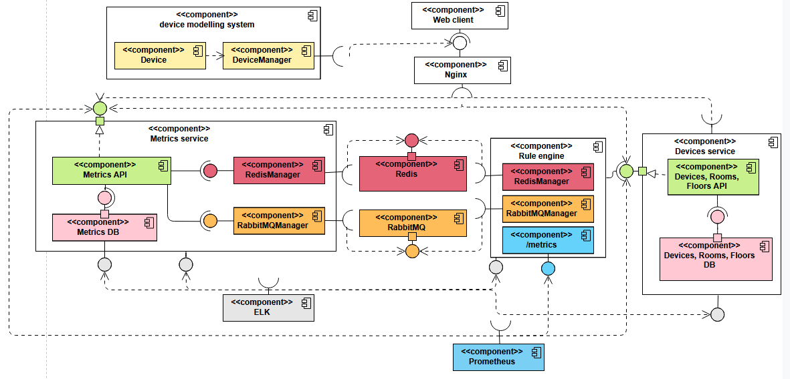
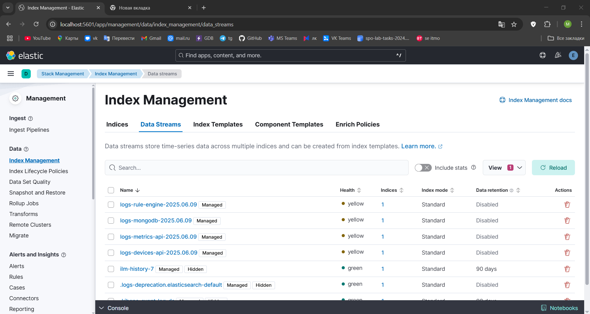

# Проектирование архитектуры и реализация проекта

## Задание

- Проектирование архитектуры
- Реализация проекта

## Ход работы

### Проектирование архитектуры

### Диаграмма компонентов

### Реализация

### `metrics-api`

Обрабатывает запросы:

- `POST /api/metrics` - выгрузка очередного значения метрики устройства.

  При получении очередной метрики сохраняет её в `MetricsDB`, обновляет значение в кэше `Redis`, а также кладет значение
  метрики в очередь `RabbitMQ`

- `GET /api/metrics/latest` - получение последней метрики устройства

  Сначала идет в `Redis`, вычитывает `HASH` по `device_id`

  Если `HASH` не пустой, то смотрит в поле `new`, если оно `True` (`rule-engine` обновил значение лампочки), то
  добавляет запись со считанной из `Redis`'a метрикой в `MetricsDB`, устанавливает в `Redis`'e в поле `new`
  значение `False`

  В случае cache-miss делает запрос к базе `MetricsDB`, записывает полученное значение в кэш `Redis` и возвращает его.

- `GET /api/metrics` - получение истории метрик за период по устройству

  Делает запрос в `MetricsDB`.

### `rule-engine`

Читает очередь в `RabbitMQ`, из которой получает очередное значение датчика и его `id`.

По этому `id` делает запрос `GET /api/devices/{id}/room` к компоненту `devices-api` для получения информации о
лампочках (их `id`), которые привязаны к той же комнате, к которой привязан датчик.

Изменяет яркость включенных лампочек, если очередной показатель освещенности с датчика не попадает в допустимый диапозон
освещенности (у комнаты есть поле `target_illuminance`, внутри `rule-engine` есть допуск в виде ±`ILLUMINANCE_DELTA`).

Измененные значения яркостей записываются в `Redis` с полем `new`=`True`.

### `devices-api`

Предоставляет доступ на чтение/создание/изменение информации об этажах, комнатах на этажах, устройствах в комнатах.

При обработке запросов на получение этажа, комнаты, устройства последнее значение метрики для каждого отдельного
устройства получает в результате `GET` запроса к компоненту `metrics-api`

### elastic

