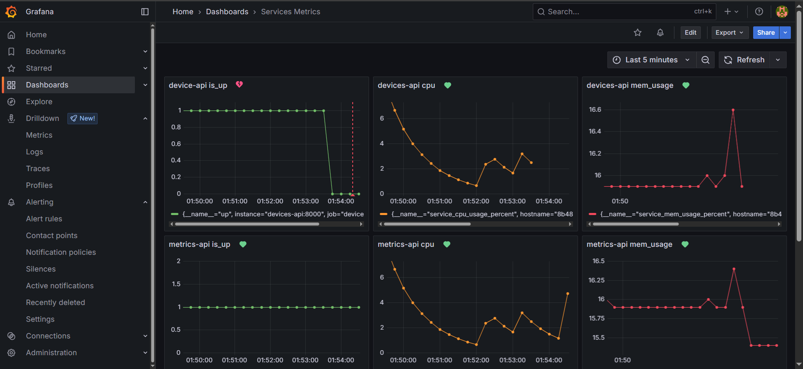
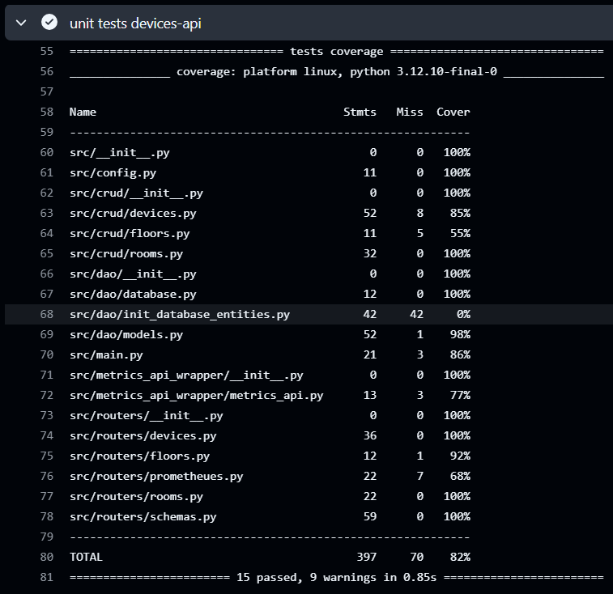
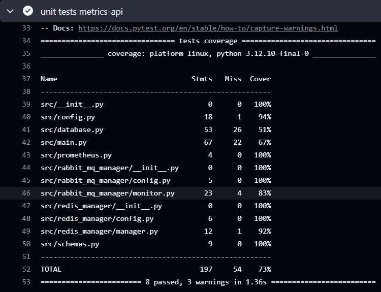
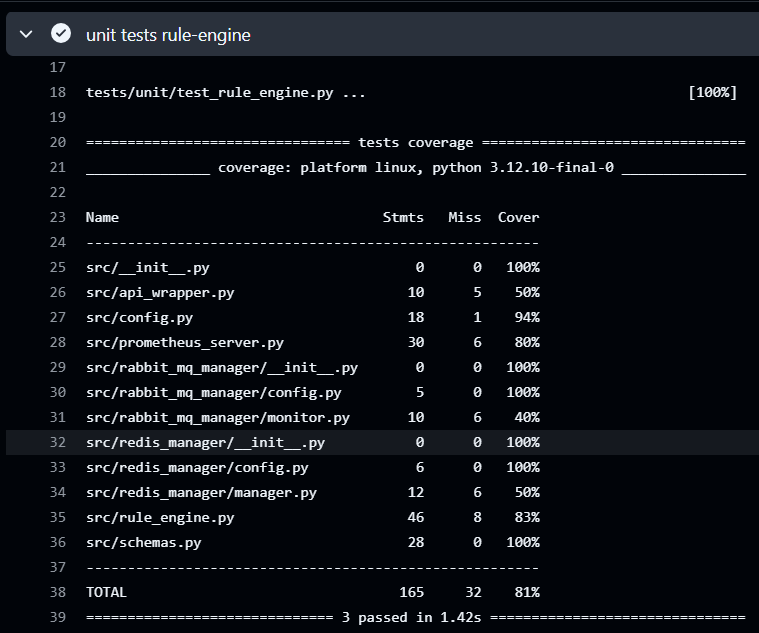
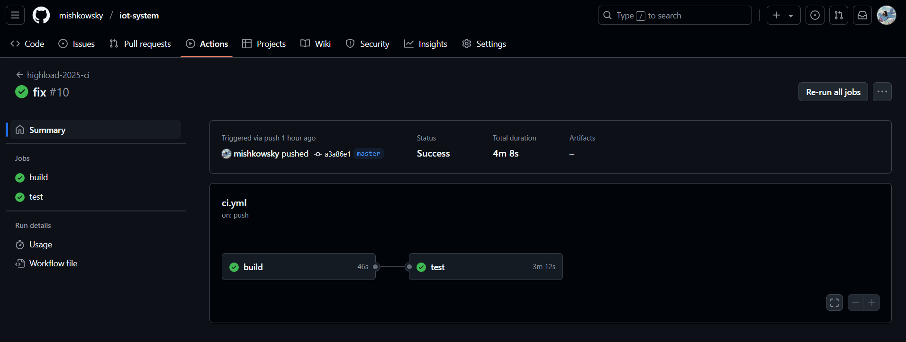

# Развертывание системы

## Задание

- Контейнеризация сервисов
- Добавление мониторинга
- Добавление автотестов
- Настройка CI/CD

## Ход работы

### Контейнеризация сервисов

Для сервисов `metrics-api`, `devices-api`, `rule-engine`, `frontend` были написаны `Dockerfie`'ы.

Развертывание всей системы описано в конфигурационном файле `docker-compose.yml`.

## Добавление мониторинга

В сервисы `metrics-api`, `devices-api`, `rule-engine` был добавлен `REST API` `endpoint` `/metrics` для выгрузки таких
метрик, как

- `CPU_usage_percent` - процент загрузки процессора текущим процессом
- `Memory_usage_percent` - процент использования памяти текущим процессом
- `Memory_usage_mb` - количество Мб используемой памяти текущим процессом

Был настроен `Dashboard` в интерфейсе `Grafana`, а также добавлены алерты для метрик

## Добавление автотестов

Были реализованы `unit` тесты для компонентов `devices-api`, `metrics-api`, `rule-engine`

### Unit tests for `devices-api`

### Unit tests for `metrics-api`

### Unit tests for `rule-engine`

### Integraion test

Был разработан интеграционный тест

## Настройка CI/CD

В качестве CI был настроен `pipeline` `GitHub Actions`, конфигурация `pipeline`'a описана в
файле `./github/workflows/ci.yml`

[pipeline link](https://github.com/mishkowsky/iot-system/actions/runs/15551525603)

