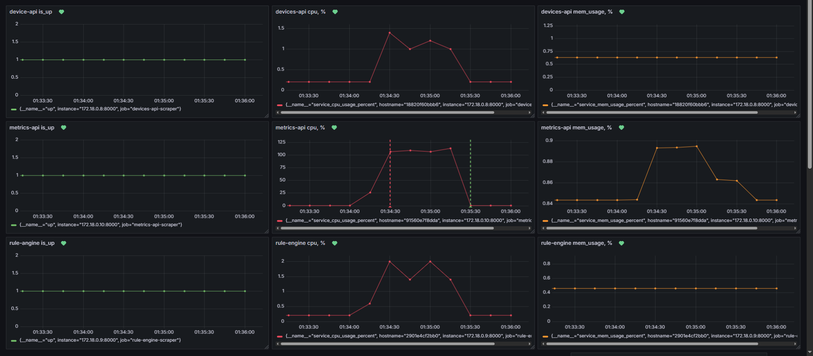
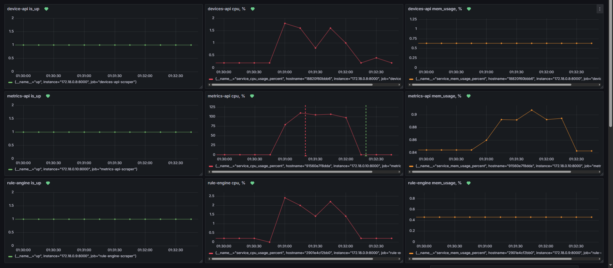
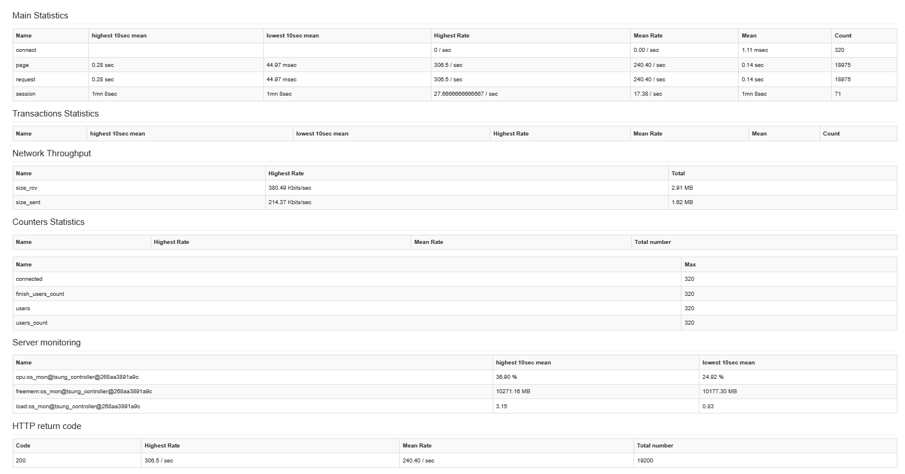
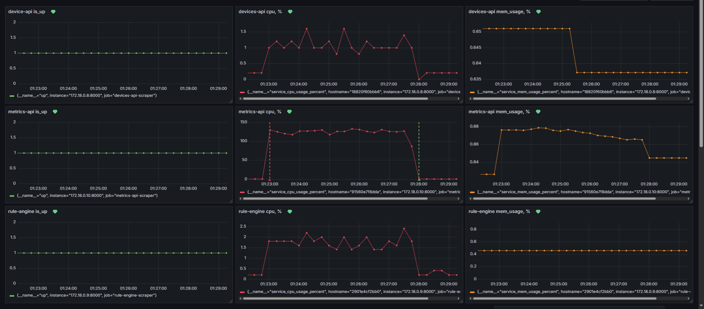
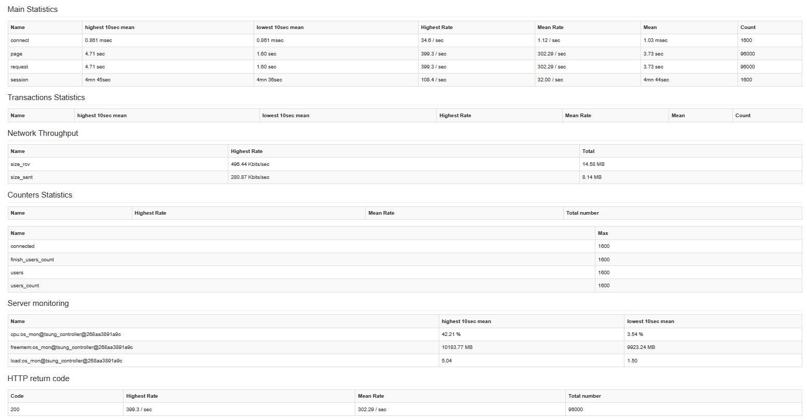
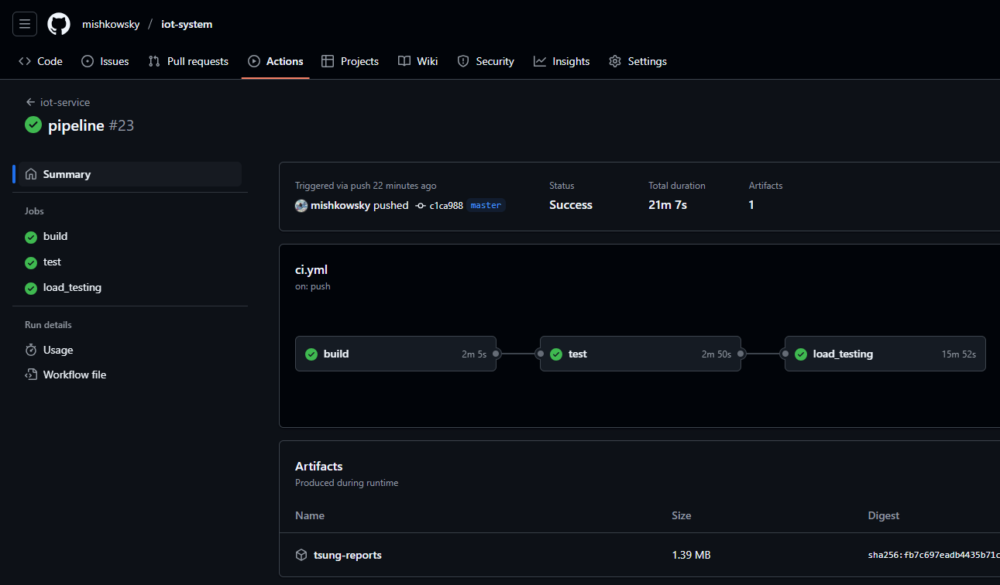

# Нагрузочное тестирование

## Задание

- Добавление `Tsung` в проект
- Описание сценариев тестирования
- Выполнение нагрузочного тестирования
- Интеграция нагрузочных тестов в CI/CD

## Ход работы

### Добавление `Tsung` в проект

В `tsung/Dockerfile` описан контейнер, в котором устанавливается `Tsung`. Контейнер используется для нагрузочного
тестирования, добавлен соответствующий `service` в `docker-compose.yml`

### Описание сценариев тестирования

Основной внешний API, который подвержен высоким нагрузким - выгрузка и получение метрики IoT
устройства - `POST /api/metrics/?device_id=X` `GET /api/metrics/latest/?device_id=X`

Производительность именно этих endpoint'ы и будет тестироваться.

Исходя из описания системы известно, что количество сенсоров - 100, ламопчек - 1500. Endpoint `POST` с выгрузкой метрики
используется только сенсором, а endpoint `GET` с получением метрики используется только лампочкой, соответственно опишем
в конфигурационном файле сценария `Tsung` две сессии, в которых выполняются соответсвующие запросы. Сессии
распределяются с вероятностями

```math
\frac{100 sensors}{1600 devices} * 100\% = 6.25\%
```

и

```math
\frac{1500 bulbs}{1600 devices} * 100\% = 93.75\%
```

Также исходя из описания системы разработаем три различных сценария:
пиковая нагрузка системы - 1600 устройств, каждое из которых отпарвляет метрику раз в секунду.

- Много пользователей (`1600`) с низкой частотой запросов от каждого (`thinktime=5`)

  конфигурация сценария представлена в файле `tsung/scenarios/low-rpc-many-users.xml`
- Мало пользователей (`320`), но высокая частота запросов от каждого (`thinktime=1`)

  конфигурация сценария представлена в файле `tsung/scenarios/hogh-rpc-few-users.xml`
- Пиковая нагрузка с большим количеством пользователей (`1600`) и высокой частотой запросов (`thinktime=1`).

  конфигурация сценария представлена в файле `tsung/scenarios/high-rpc-many-users.xml`

В качестве тестовых данных в базе устройств создается 10 этажей по 10 комнат по 16 устройств в каждой (1 датчик и 10
лампочек), что в общем состовляет 1600 устройств. Подробнее - `devices-api/src/dao/init_database_entites.py`

В базе метрик создается по 1000 записей на каждое устройство, что в общем составляет 1.6М записей. Также при создании
тестовых записей метрик заполняется кэш `Redis`, поскольку ключи в нем не имеют ограничений по TTL и их отсутствие может
быть только при инициализации системы или нового устройства. Подробнее - `metrics-api/src/create_test_db_entites.py`

### Нагрузочное тестирование.

Проведем нагрузочное тестирование по разработанным сценариям.

### `low-rpc many-users`




### `high-rpc few-users`




### `high-rpc many-users`




## Выводы по результатам тестирования.

Система успешно справилась с нагрузкой в случаях `high-rpc-few-users` и `low-rpc-many-users`, время ответа для этих
тестов удовлетворяет требованию в 1 секунду, однако в случае пиковой нагрузки в 4.71 раз превышает допустимое значение.

Исходя из приведенных графиков заметна сравнительно высокая нагрузка на сервис `metrics-api`. Этот сервис и является
узким местом, которое нуждается в оптимизации.

[//]: # (Также стоит отметить, что в данной реализации уже был использован кэш `Redis` для хранения последних значений метрики для каждого устройства.)

[//]: # ()

[//]: # (Если же очистить полностью кэш и провести тестирование, то результаты значительно ухудшатся)

[//]: # (![]&#40;img/4/grafana/high-rpc-many-users-no-cache.png&#41;)

[//]: # (![]&#40;img/4/tsung/high-rpc-many-users-no-cache.png&#41;)

[//]: # ()

[//]: # (Сервис `metrics-api` упирается в долгие синхронные запросы к базе и перестает быть доступным, что заметно по невысокой нагрузке на CPU и отсутсвию метрик в начальные моменты тестирования. )

[//]: # ()

[//]: # (По истечению некоторого времени и заполнения кэша, сервис начинает снова отправлять метрики и оперативно отвечать на запросы, нагрузка на CPU увеличивается.)

[//]: # ()

[//]: # (Отсюда можно сделать вывод о критичности использования кэша в данной реалзиации.)

## Предложения по улучшению производительности и устранению выявленных проблем.

Повысить производительность системы и снизить время отклика предлагается за счет масштабирования сервиса `metrics-api` и
шардирования нижележащей базы данных `MongoDB`.

## Интеграция нагрузочных тестов в CI/CD

Нагрузочные тесты интегрированы в CI GitHub Actions
[pipeline link](https://github.com/mishkowsky/iot-system/actions/runs/15613712400)


