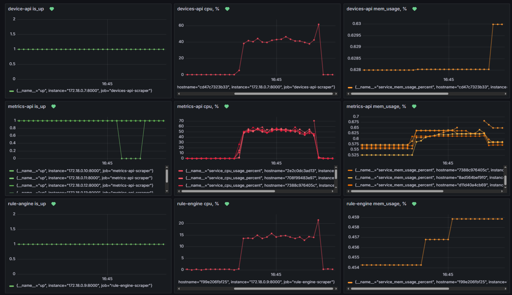
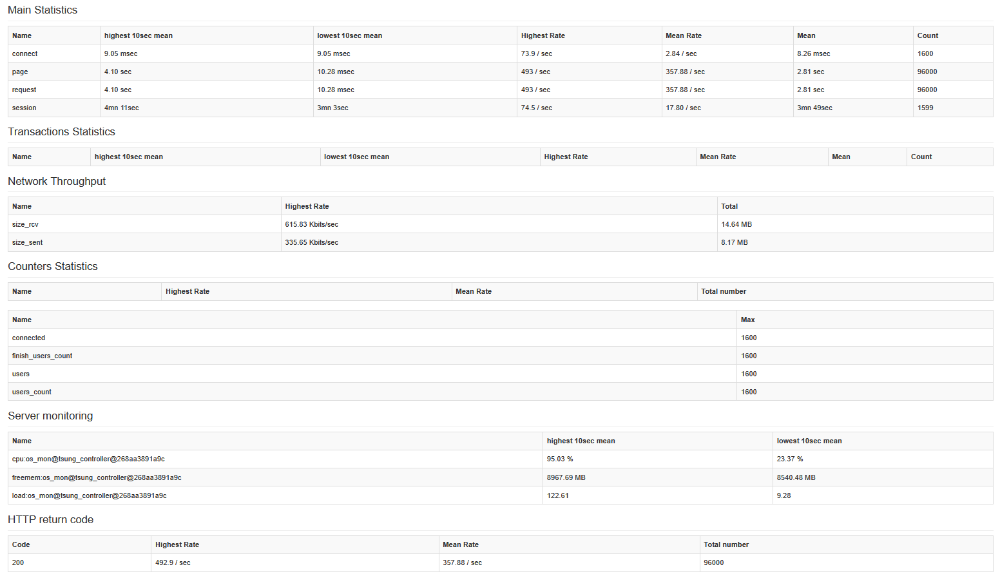
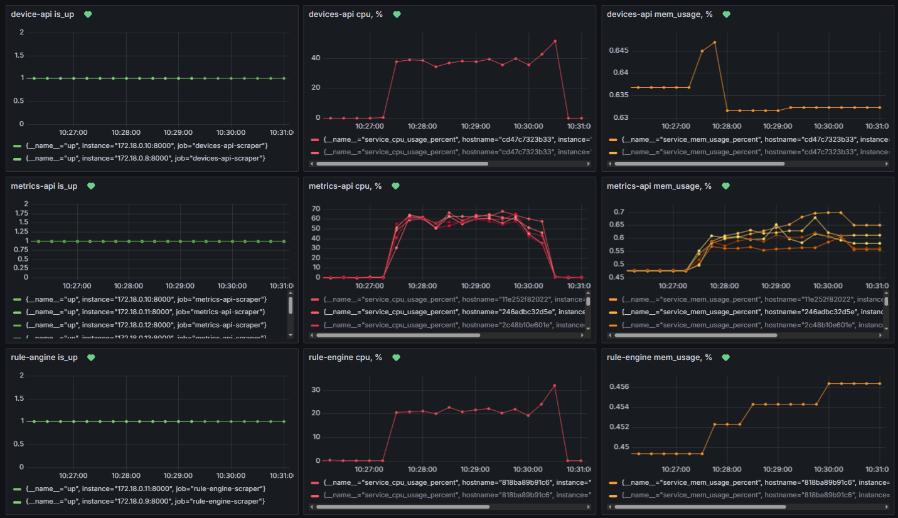
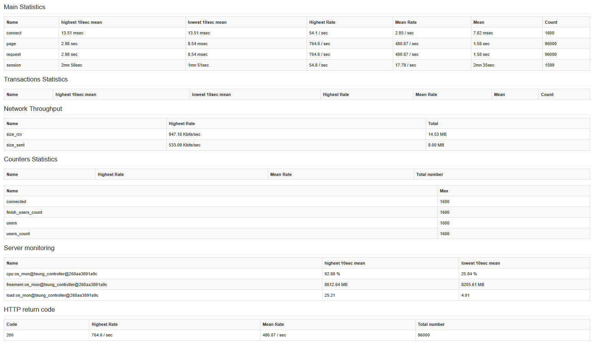
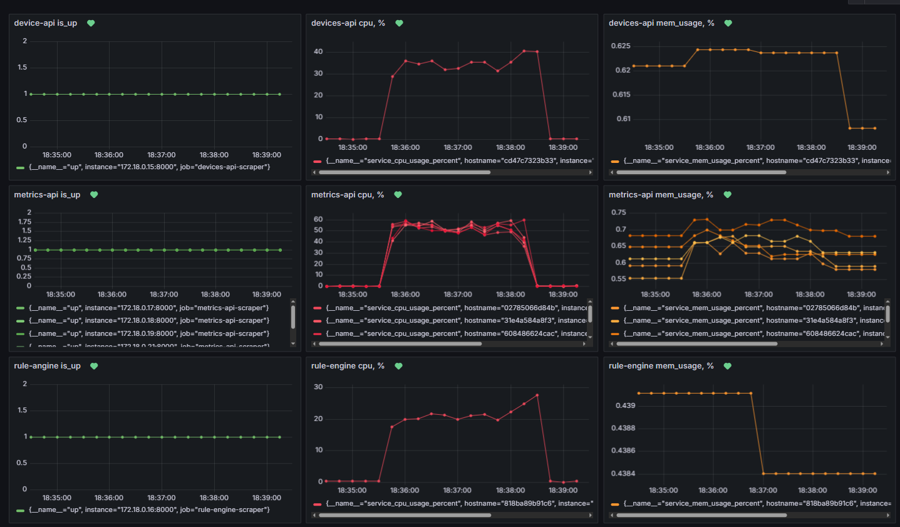

# Оптимизация хранения данных

## Задание

- Кэширование
- Репликация и шардирование
- Анализ результатов

## Ход работы

### Кэширование

В системе изначально было реализовано кэширование и оно использовалось в качестве связывающего компонента
между `rule-engine` и `metrics-api`, его исключение из системы существенно повлияет на ее работу, продемонстрируем это.

[//]: # (До исключения: `rule-engine` достает значение лампочки из кэша, добавляет к нему `adjustment` и записывает обновленное значение лампочки в кэш, а `metrics-api` считывал значения при запросе от лампочки и заносил в БД при необходимости &#40;если значение в кэше было новым&#41;)

[//]: # ()

[//]: # (После исключения: `rule-engine` делает дополнительный API запрос к `metrics-api` для обновления яркостей лампочек по их `id`, `metrics-api` достает из БД последнее значение для лампочки, прибавляет к нему полученный от `rule-engine` `adjustment` и заносит обновленное значение в базу, это создает дополнительную нагрузку на `metrics-api` и `metrics-db`)

Оценим количество вызовов к БД `metrics-api` при обработке новой метрики от сенсора с кэшем и без:

- с кэшем:

  `metrics-api` получает метрику от сенсора, кладет её в БД `metrics-api` (1 операция), кэш `Redis` и `RabbitMQ`

  `rule-engine` получает очередную метрику из `RabbitMQ`, делает запрос к `devices-api` для получения привязанных к
  сенсору лампочек (15), рассчитывает `adjustment`, вычитывает последние значения для лампочек из кэша,
  прибавляет `adjustment` и кладет их обратно.

  `metricsa-api` занесет значения из кэша в БД при соответствующем запросе последней метрики от лампочки (15 операций).

  В комнате 15 лампочек, а это значит, что при использовании кэша потребуется 16 операций к БД (если учитывать, что в
  кэше всегда хранятся последние значения метрик устройств)
- без кэша:

  `metrics-api` получает метрику от сенсора, кладет её в БД `metrics-db` (1 операция) и `RabbitMQ`

  `rule-engine` получает очередную метрику из `RabbitMQ`, делает запрос к `devices-api`, рассчитывает `adjustment`,
  делает запрос к `metrics-api` на обновление соответствующих лампочек

  `metrics-api` для полученных `id` делает запрос последней метрики в БД `metrics-bd` (15 операций),
  прибавляет `adjustment` и записывает обновленное значение в БД (15 операций)

Таким образом использование кэша позволяет сократить количество запросов к БД на 48% (31 запрос vs 16 запросов)

Проведем нагрузочное тестирование без использования кэша `Redis` с 5 репликами сервиса `metrics-api` по
сценарию `high-rpc-many-users`




Реузльтаты для аналогичного сценария и аналогичной конфигурации, но с кэшем:


По результатам тестирования можно сделать вывод, что конфигурация системы с кэшем дает прирост производительности в
35% (RPC=357.88 vs RPC=483.50)

### Репликация




### Репликация и шардирование

База данных была разделена на 2 шарда по ключу `device_id`

```bash
[direct: mongos] test> sh.status()
shardingVersion
{ _id: 1, clusterId: ObjectId('68501bf0ebd056c542c16136') }
---
shards
[
  {
    _id: 'rs-shard-01',
    host: 'rs-shard-01/metrics-db-shard01-a:27017,metrics-db-shard01-b:27017,metrics-db-shard01-c:27017',
    state: 1,
    topologyTime: Timestamp({ t: 1750080540, i: 10 }),
    replSetConfigVersion: Long('1')
  },
  {
    _id: 'rs-shard-02',
    host: 'rs-shard-02/metrics-db-shard02-a:27017,metrics-db-shard02-b:27017,metrics-db-shard02-c:27017',
    state: 1,
    topologyTime: Timestamp({ t: 1750080541, i: 8 }),
    replSetConfigVersion: Long('1')
  }
]
---
active mongoses
[ { '8.0.10': 1 } ]
---
autosplit
{ 'Currently enabled': 'yes' }
---
balancer
{
  'Currently enabled': 'yes',
  'Failed balancer rounds in last 5 attempts': 0,
  'Currently running': 'no',
  'Migration Results for the last 24 hours': {
    '31': "Failed with error 'aborted', from rs-shard-02 to rs-shard-01",
    '100': 'Success'
  }
}
---
shardedDataDistribution
[
  {
    ns: 'config.system.sessions',
    shards: [
      {
        shardName: 'rs-shard-01',
        numOrphanedDocs: 0,
        numOwnedDocuments: 1,
        ownedSizeBytes: 99,
        orphanedSizeBytes: 0
      }
    ]
  },
  {
    ns: 'metrics_db.metrics',
    shards: [
      {
        shardName: 'rs-shard-02',
        numOrphanedDocs: 0,
        numOwnedDocuments: 1649898,
        ownedSizeBytes: 110543166,
        orphanedSizeBytes: 0
      },
      {
        shardName: 'rs-shard-01',
        numOrphanedDocs: 0,
        numOwnedDocuments: 1671542,
        ownedSizeBytes: 111993314,
        orphanedSizeBytes: 0
      }
    ]
  }
]
---
databases
[
  {
    database: { _id: 'config', primary: 'config', partitioned: true },
    collections: {
      'config.system.sessions': {
        shardKey: { _id: 1 },
        unique: false,
        balancing: true,
        chunkMetadata: [ { shard: 'rs-shard-01', nChunks: 1 } ],
        chunks: [
          { min: { _id: MinKey() }, max: { _id: MaxKey() }, 'on shard': 'rs-shard-01', 'last modified': Timestamp({ t: 1, i: 0 }) }
        ],
        tags: []
      }
    }
  },
  {
    database: {
      _id: 'metrics_db',
      primary: 'rs-shard-01',
      version: {
        uuid: UUID('919c73c1-63b7-4f48-8aab-1a9b1672d830'),
        timestamp: Timestamp({ t: 1750080715, i: 3 }),
        lastMod: 1
      }
    },
    collections: {
      'metrics_db.metrics': {
        shardKey: { device_id: 1 },
        unique: false,
        balancing: true,
        chunkMetadata: [
          { shard: 'rs-shard-01', nChunks: 1 },
          { shard: 'rs-shard-02', nChunks: 1 }
        ],
        chunks: [
          { min: { device_id: MinKey() }, max: { device_id: 795 }, 'on shard': 'rs-shard-02', 'last modified': Timestamp({ t: 101, i: 2 }) },
          { min: { device_id: 795 }, max: { device_id: MaxKey() }, 'on shard': 'rs-shard-01', 'last modified': Timestamp({ t: 101, i: 1 }) }
        ],
        tags: []
      }
    }
  }
]

```




### Анализ результатов

| approach          | mean request time, sec | Mean Rate, op/sec |
|-------------------|------------------------|-------------------|
| single            | 1.89                   | 456.17            |
| replicas          | 1.58                   | 480.87            |
| replicas-sharding | 1.44                   | 485.01            |

Реплицирование БД `metrics-db` позволило повысить производительность системы на 5.26% (456.17 до, 480.87 после)

Шардирование с реплицированием позволило повысить производительность системы на 1.04% (480.87 до, 485.01 после) 

[//]: # (Также стоит отметить, что полученные результаты могут быть не самыми репрезентативными ввиду нехватки физических )

[//]: # (ресурсов хостовой машины)

[//]: # ()
[//]: # (![]&#40;img/6/img.png&#41;)
